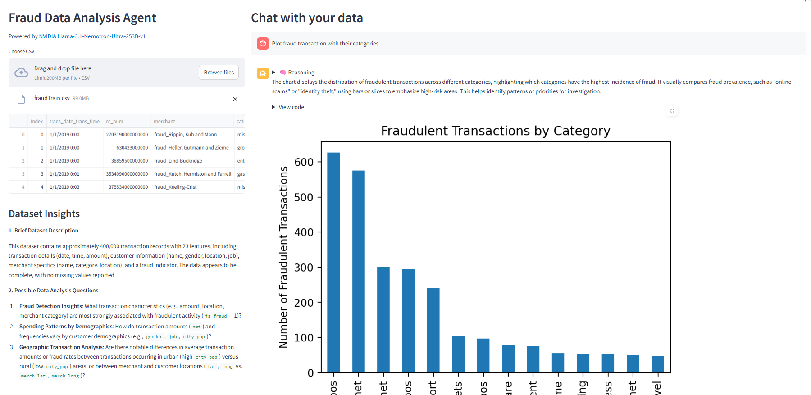

# 🧠 Fraud Data Analysis Agent

This Streamlit app enables you to **chat with your CSV datasets** to explore, visualize, and reason about fraud-related patterns using an NVIDIA-hosted LLM.

## 🚀 Features

- Upload a CSV and get automatic insights.
- Ask questions in natural language.
- Auto-generates Pandas and Matplotlib code using LLM.
- Displays visualizations if the query requires.
- Provides reasoning behind results or charts.
- Streams model "thinking" in real-time with explanation.

## 🛠️ How It Works

1. Upload a CSV file.
2. Ask a question (e.g., *"Plot transaction amounts over time."*)
3. The app:
   - Detects intent (visual or not)
   - Generates Pandas/Matplotlib code
   - Executes code safely
   - Streams reasoning
   - Displays result

## 🤖 Powered By

- [NVIDIA Llama-3.1-Nemotron-Ultra-253B-v1](https://build.nvidia.com/nvidia/llama-3_1-nemotron-ultra-253b-v1)
- [OpenAI Python SDK](https://github.com/openai/openai-python)
- Streamlit
- Pandas, Matplotlib

## 📸 Example

Here's an example of how the app works:



**Steps:**
1. Upload a CSV file using the left panel.
2. Ask a question like: `Show transaction trends over time`.
3. View the generated chart and reasoning from the LLM.

> 📌 Place your screenshot at `screenshots/example.png`.

## 📂 Folder Structure

```
.
├── .py
├── README.md
├── requirements.txt
├── screenshots/
│   └── example.png
```

## 📦 Setup Instructions

1. Clone the repo
2. Install dependencies:
   ```
   pip install -r requirements.txt
   ```
3. Set your API key:
   ```
   export NVIDIA_API_KEY=your_key_here
   ```
4. Run the app:
   ```
   streamlit run fraud_analysis_agent.py
   ```

---

Built for fraud analysts, data teams, and AI engineers.
